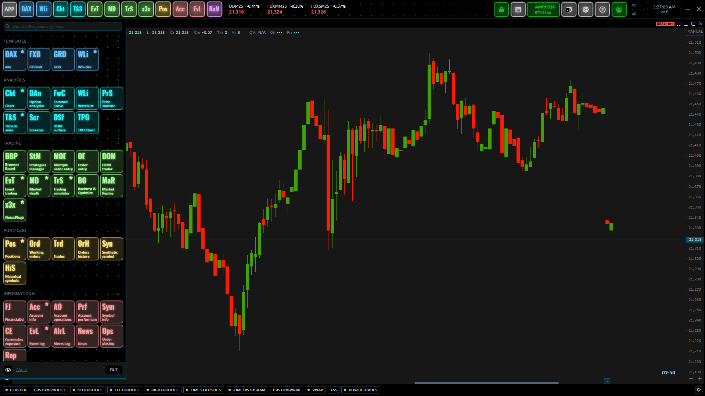
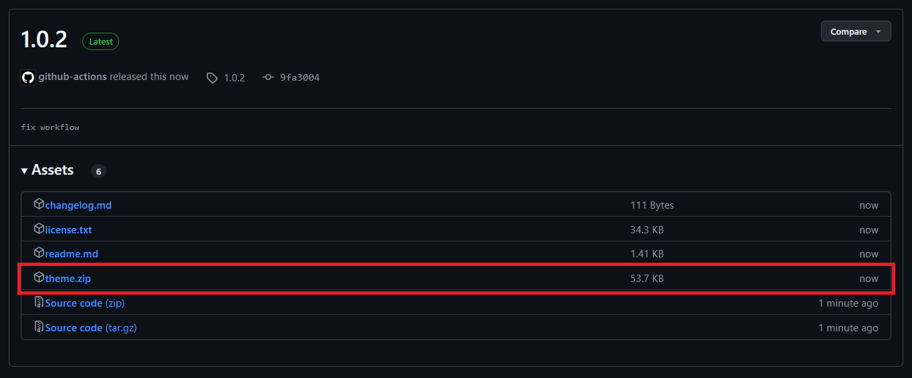

# Quantower Neon Theme

- License: **[GPL-3.0 License](./license.txt)**

Welcome to the `Quantower Neon Theme` project! This repository
  contains a custom theme for Quantower, designed to bring a neon
  style to the interface. It transforms the application's appearance
  by adding bright colors while maintaining readability and clarity.

This theme is my personal theme that I use on a daily basis in Quantower.
  I created it to add a touch of neon color while remaining functional
  and pleasing to the eye. It's totally open-source and licensed under
  [GPL-3.0 License](./license.txt), so you can use it, modify it and adapt
  it to your needs.

## Important Note

This theme is currently in **beta**. Updates will likely be made 
  progressively based on my personal needs and preferences. However, 
  any relevant suggestions are welcome, as long as they align with 
  the theme's vision (style improvements, visual enhancements, etc.).
  Feel free to open **issues**!

## Install

### 0. Download the [Latest Release](https://github.com/qtx-project/theme-neon-quantower/releases)

Go to the GitHub releases page and download the `theme.zip` file. 
While you can download the entire release, only `theme.zip` is necessary 
for theme installation.

 

### 1. Extract the ZIP File

Once the `theme.zip` file is downloaded, open it and extract the 
`theme-neon-quantower` folder.

### 2. Move the Theme to the Appropriate Folder

Move the extracted theme-neon-quantower folder into your Quantower 
**themes directory**. This is typically located at `Quantower/Settings/Themes/..`

### 3. Restart Quantower

After moving the theme, restart Quantower to apply the changes and
apply the theme via Quantower settings.

## License

This theme is distributed under the [GPL-3.0 License](./license.txt), 
  which allows you to use, modify and share it freely under the conditions 
  of this license.
